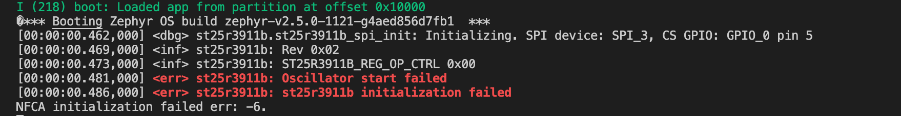

# Repository for Hubble Firmware

# Table Of Contents
* [ Installing Prerequisites ](#Prerequisites) <br>
* [ Hardware ](#Hardware) <br>
* [ Instruction ](#Instruction) <br>
* [ Project ](#Project) <br>
* [ Status ](#Status) <br>

<a name="Prerequisites"></a>
# Installing Prerequisites
* **Python 3.8x and above** : Download and install Python from <a href="https://www.python.org/downloads/">here</a>
* **Git** : Get the latest git from <a href ="https://git-scm.com/downloads">here</a>
* **West** : Get west tool from <a href ="https://docs.zephyrproject.org/latest/guides/west/">here</a>

**Note:** Make sure West, Python and Git are available on the system environment PATH.

<a name="Hardware"></a>
# Hardware

*  **ESP32 Chipset** : Reference link from <a href = "https://www.espressif.com/en/products/socs/esp32"> here </a>
*  **ESP32 Eval Kit** : Reference link from <a href = "https://www.espressif.com/en/products/devkits"> here </a>

<a name="Instruction"></a>
# Instruction

* Step 1: Install west environment by using command 

```
pip3 install --user west
```

* Step 2: Export PATH environment to add **west** command. Example:

```
export PATH=/Users/User/Library/Python/3.9/bin:$PATH
```

* Step 3: Initialize Zephyr environment with command as below

```
west init -m https://github.com/zephyrproject-rtos/zephyr.git
```

Output tree directory as picture below


* Step 4: Install ESP32 environment 

```
cd [Zephyr_Root]/modules/hal/espressif

source install.sh

```

Result:

```
All done! You can now run:

  . ./export.sh
```

* Step 5: Setup script to load ESP32 environment as code.

```
   export ZEPHYR_TOOLCHAIN_VARIANT="espressif"
   export ESPRESSIF_TOOLCHAIN_PATH="${HOME}/.espressif/tools/xtensa-esp32-elf/esp-2020r3-8.4.0/xtensa-esp32-elf"
   export PATH=$PATH:$ESPRESSIF_TOOLCHAIN_PATH/bin

```

Then, you need to load it. Notice **env.sh** is script file we just created.

```
source env.sh
```

* Step 6: Load Zepyr environment

```
source zephyr/zephyr-env.sh
```

* Step 7: Build example and flash to ESP32 device

> To build device, use command as below 

```
west build -b esp32 zephyr/samples/hello_world
```


> To flash device, use command as below

```
west flash -d build/ --esp-device /dev/tty.SLAB_USBtoUART && screen /dev/ttySLAB_USBtoUART 115200
```

Notice: **/dev/ttySLAB_USBtoUART** is ESP32 COM/PORT


<a name="Project"></a>
# Project Guide

The current system is using porting ST25 from Nordic. So, we have to update our Zephyr to support it.

Notice: **$GIT** is our clone directory  

Step 1: Clone our current repository.  

Step 2: Load environment step 5 and step 6.  

Step 3: Copy file $GIT/patch/st,st25r3911b.yaml and paste to zephyr/dts/bindings/net/nfc.  

Step 4: Build our application with command as below. 

```
cd $GIT
west build -b esp32
```

Step 5: Load and verify our application.

```
west flash -d build/ --esp-device /dev/tty.SLAB_USBtoUART && screen /dev/ttySLAB_USBtoUART 115200
```

Current result as below:



<a name="Status"></a>
# Status of Current Project

- [x] Setup environment  
- [x] ST25  
  + - [x] Verify SPI interface by reading ID address  
  + - [ ] Functionality of NFC  
- [ ] WIFI feature
  + - [ ] Smart Config
  + - [ ] AWS IoT
  + - [ ] REST API
- [ ] T.B.D